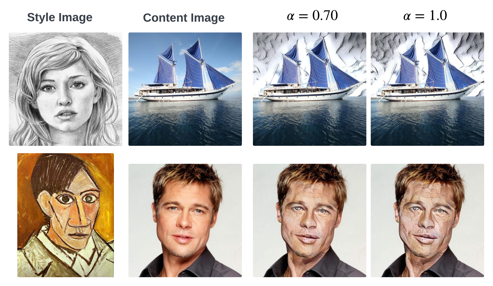

## Segify: Semantic Segmentation for Localized Artistic Effects 

This project tackles segment-based neural style transfer, allowing users to apply artistic styles to specific regions within an image. It combines the efficiency of AdaIN layers (Reference 1) with the accuracy of the Segment Anything model, SAM, (Reference 2) by Meta AI and offers an interactive user interface, using Python's Streamlit (Reference 3), for creative exploration.

### Inspiration

Traditional neural style transfer methods apply style globally across the entire image. This project addresses this limitation by enabling users to define the target region for style transfer. This approach is inspired by the following works:

* **Arbitrary Style Transfer in Real-time with Adaptive Instance Normalization** (Huang et al.) (Reference 1): This paper introduces AdaIN layers, significantly improving the efficiency of style transfer.
* **Samstyler: Enhancing Visual Creativity with Neural Style Transfer and Segment Anything Model (SAM)** (Psychogyios et al.) (Reference 4): This work proposes a system that integrates neural style transfer with the SAM model for user-guided segmentation.

### Approach

The project leverages recent advancements in deep learning to achieve real-time, user-guided style transfer for specific image regions:

1. **Real-time Style Transfer with AdaIN:** The project incorporates AdaIN layers within a VGG-based style transfer network, enabling efficient style transfer as demonstrated by Huang et al. (2017).
2. **Accurate Segmentation with SAM:** The project utilizes the state-of-the-art SAM model for precise image segmentation, ensuring accurate delineation of the target region for style transfer.
3. **Interactive User Interface:**  A user-friendly interface allows users to:
    * Upload an image.
    * Define a mask to target the specific region for style transfer.
    * Choose the artistic style to apply.
    * Control the styling parameter.
4. **Localized Style Transfer:** The user-defined mask is combined with the AdaIN-powered style transfer model to meticulously apply style only within the designated region.
   
   |                                                       | 
   |:------------------------------------------------------------------------------------------------------:| 
   | *Workflow for Segify. α is the style loss weight and the final stylized segments are shown with α = 1* |


### Prerequisites
- Python 3.x
- Dependencies: PyTorch, Numpy, Pillow, Streamlit, Torchvision

### Getting Started
However, the following steps show how to run this project locally:

1. **Project Setup:**
   ```python
    git clone https://github.com/g-nitin/stylized-segmentation.git
    cd stylized-segmentation
    pip install -r requirements.txt
   ```
2. **Run:**
   ```python
    streamlit run main.py
   ```
3. **Notes:**
   - When the streamlit app will run, it will download the model weights for SAM and the vgg model in the `model` subdirectory.
   - By default, streamlit limits file/image uploads to 200MB. However, uploading images of this size might slow down the app.
   To limit the file upload size, a config file, under `.streamlit/`, has been created.

### Project Structure
* `models` sub-directory contains the torch pth files for the model and their weights.
* `imgs` sub-directory contains images for testing the app. More specifically, it contains some content and style images from Huang et al. (Reference 1). _See the Results section below for a comparision._
* `pages` sub-directory contains 3 Python scripts for the Streamlit app. Learn more about Streamlit pages [here](https://docs.streamlit.io/get-started/tutorials/create-a-multipage-app).
* 2 Python scripts, `adain.py` and `adain_net.py` contain the AdaIN net and were adapted from Reference 5.

### Results
|                   | 
|:------------------------------------------------------------------:| 
| *Segify's results for different values of the style loss weight α* |

|                                                                 | 
|:----------------------------------------------------------------------------------------------------------------:| 
| *A comparison of Segify’s results from some of the the content and style images from Huang et al. (Reference 1)* |


### References
This work was possible by the following papers and implementations:
1. Huang, Xun, and Serge Belongie. "Arbitrary style transfer in real-time with adaptive instance normalization." Proceedings of the IEEE international conference on computer vision. 2017. 
2. Kirillov, Alexander, et al. "Segment anything." Proceedings of the IEEE/CVF International Conference on Computer Vision. 2023.
3. Streamlit • A Faster Way to Build and Share Data Apps, streamlit.io. Accessed 3 May 2024.
4. Psychogyios, Konstantinos, et al. "Samstyler: Enhancing visual creativity with neural style transfer and segment anything model (sam)." IEEE Access (2023).
5. https://github.com/naoto0804/pytorch-AdaIN/tree/master